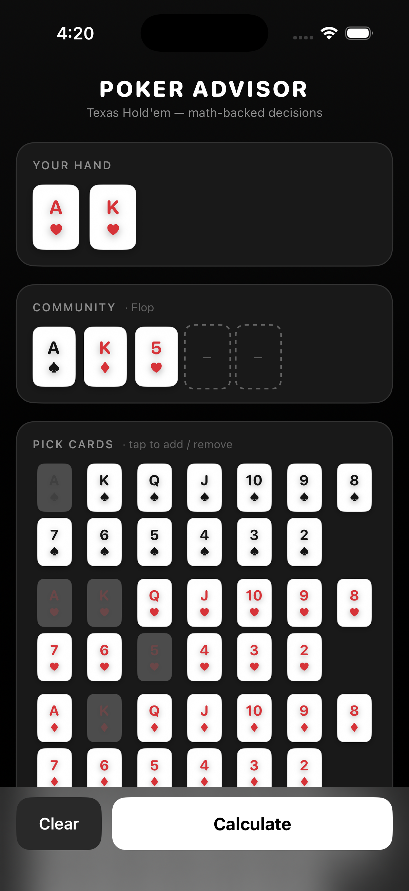
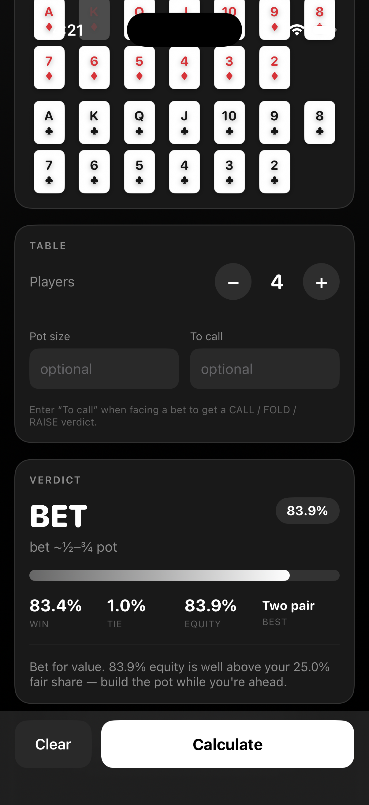

# ♠ Poker Advisor

A math-backed Texas Hold'em decision aid. Pick your cards, the number of players, and (optionally) the pot odds — it runs a **Monte Carlo equity simulation** and tells you whether to **FOLD / CHECK / CALL / BET / RAISE**, and how much.

Two front-ends, one verified engine:

- **`index.html`** — a self-contained web app (no build, no dependencies — just open it in a browser).
- **`PokerAdvisor-iOS/`** — a native **SwiftUI** iPhone app with a premium dark UI.

## Screenshots

<p align="center">
  
  &nbsp;&nbsp;
  
</p>

<p align="center"><em>Pick your hand &amp; board, then get a math-backed verdict with full equity breakdown.</em></p>

---

## How it works

For each decision it deals tens of thousands of random outcomes (random opponent hands + remaining community cards), evaluates every 7-card hand, and computes your true **equity** (win % + half of tie %). It then turns that into a decision:

- **Facing a bet** (you enter pot + amount to call): compares your equity to the **pot odds** (break-even %). Below it → FOLD. Comfortably above → CALL. Big edge (>66%) → value RAISE.
- **No bet yet**: compares equity to your fair share (1 ÷ players) → BET or CHECK.

The RNG is **seeded from the inputs**, so the same hand always returns the exact same verdict (no flicker between runs).

## Accuracy

The engine was validated against a **1,000-hand dataset per player count (3–6)** versus a high-iteration reference:

| Players | Equity error (MAE) | Decision match vs reference |
|--------:|-------------------:|----------------------------:|
| 3 | ~0.12 pp | ~99% |
| 4 | ~0.11 pp | ~100% |
| 5 | ~0.10 pp | ~100% |
| 6 | ~0.09 pp | ~100% |

Textbook spot-checks also match: AA vs 1 ≈ 85%, AKs vs 1 ≈ 67%.

Test harness lives in `test/` (`engine.mjs`, `accuracy.mjs`). Run it with:

```bash
node test/accuracy.mjs 1000 200000
```

## Web app

Open `index.html` in any modern browser. Tap cards to add/remove, set players, optionally enter pot + to-call, hit **Calculate**.

## iOS app

Open `PokerAdvisor-iOS/PokerAdvisor.xcodeproj` in Xcode 16+ and Run.

- Deployment target: iOS 17+
- Premium black/white/gray UI with traditional red/black suit colors
- Engine: `PokerAdvisor/PokerEngine.swift` (pure Swift, unit-tested from the command line)

### Build from the command line

```bash
xcodebuild build -scheme PokerAdvisor \
  -destination 'platform=iOS Simulator,name=iPhone 17 Pro'
```

---

> A study & play-money aid. Gamble responsibly.
